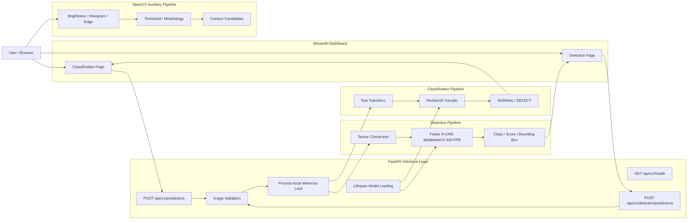
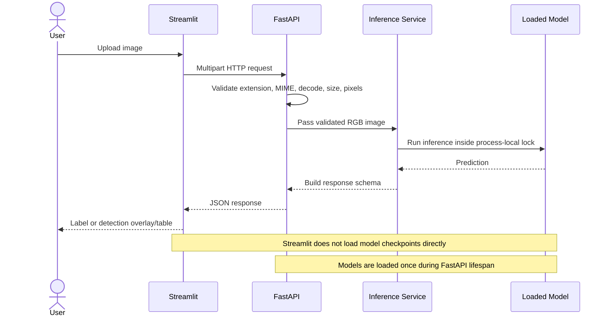

# Manufacturing Vision Defect Analysis System

> 제조 이미지의 **정상·불량 분류**, **OpenCV 보조 분석**, **표면 결함 객체 탐지**를 FastAPI와 Streamlit으로 연결한 PyTorch 기반 제조 비전 프로젝트

이 프로젝트는 모델 학습에서 끝내지 않고 데이터 분석, 평가, 실패 사례 분석, 추론 API, 사용자 화면까지 하나의 흐름으로 구현하는 것을 목표로 했습니다.  
Classification과 Object Detection은 서로 다른 데이터셋과 목적을 사용하며, OpenCV 분석은 학습 모델을 대체하지 않는 보조 분석으로 분리했습니다.

---

## Key Results

| 영역 | 모델·방법 | 최종 결과 |
|---|---|---|
| Image Classification | ResNet18 Transfer Learning | Accuracy **97.34%**, Precision **97.17%**, Recall **98.68%**, F1 **97.92%** |
| Classification Confusion Matrix | NORMAL / DEFECT | TN **249**, FP **13**, FN **6**, TP **447** |
| Object Detection | Faster R-CNN MobileNetV3 Large 320 FPN | Precision **0.812950**, Recall **0.526807**, F1 **0.639321** |
| Detection Localization | IoU 0.50 | Mean Matched IoU **0.752338**, mAP@0.50 **0.707726** |
| Project AP | All-point interpolation | AP 0.50:0.95 **0.310533** |
| Verification | Pytest full regression | **1737 passed**, 1 warning, 100.56 seconds |

> `Project AP 0.50:0.95`는 프로젝트 내부 all-point interpolation 구현 결과입니다. 공식 COCOeval 지표와 동일한 값으로 해석하지 않습니다.

---

## Problem

제조 이미지 검사에서는 서로 다른 수준의 질문이 필요합니다.

1. 이미지 전체가 정상인지 불량인지
2. 밝기, 경계, 형태 특성이 어떻게 나타나는지
3. 어떤 결함이 어느 위치에 존재하는지
4. 모델 결과를 API와 사용자 화면에서 어떻게 일관되게 제공할지

하나의 모델이 모든 질문에 답하도록 만들기보다, 목적에 따라 세 개의 분석 흐름을 분리했습니다.

| Pipeline | 역할 | 출력 |
|---|---|---|
| Classification | 이미지 전체 정상·불량 판정 | `NORMAL` / `DEFECT`, probability |
| OpenCV Analysis | 명암·경계·형태 특성 보조 분석 | histogram, edge, threshold, morphology, contour candidates |
| Object Detection | 결함 종류와 위치 예측 | class, score, bounding box |

OpenCV Contour는 Threshold와 Morphology에서 얻은 **후보 영역**이며, Ground Truth 또는 Detection Bounding Box로 취급하지 않습니다.

---

## System Architecture



### Request Flow



---

## Core Features

### 1. Binary Image Classification

- Dataset: Casting Product Image Data for Quality Inspection
- Labels: `0=NORMAL`, `1=DEFECT`
- Model: ResNet18 Transfer Learning
- Test set: 715 images
- Evaluation: Accuracy, Precision, Recall, F1, Confusion Matrix
- Analysis: misclassified samples and Grad-CAM

Classification은 이미지 전체의 상태를 판단하며 결함 위치나 세부 결함 종류는 반환하지 않습니다.

### 2. OpenCV Auxiliary Analysis

- grayscale brightness statistics
- histogram analysis
- binary threshold
- Canny edge
- morphology
- contour candidate extraction

OpenCV 결과는 딥러닝 모델의 예측을 대체하지 않고, 이미지 특성을 확인하기 위한 보조 정보로 사용합니다.

### 3. Object Detection

- Dataset: NEU Surface Defect Database
- Annotation: Pascal VOC XML
- Images: 1,800
- Valid bounding boxes: 4,189
- Classes: crazing, inclusion, patches, pitted_surface, rolled_in_scale, scratches
- Model: Faster R-CNN MobileNetV3 Large 320 FPN
- Best checkpoint selected by validation mAP@0.50

| Split | Images | Boxes |
|---|---:|---:|
| Train | 1,440 | 3,335 |
| Validation | 178 | 425 |
| Test | 182 | 429 |
| Total | 1,800 | 4,189 |

---

## Model Evaluation

### Classification

| Metric | Result |
|---|---:|
| Accuracy | 97.34% |
| Precision | 97.17% |
| Recall | 98.68% |
| F1 | 97.92% |

|  | Predicted NORMAL | Predicted DEFECT |
|---|---:|---:|
| Actual NORMAL | 249 | 13 |
| Actual DEFECT | 6 | 447 |

### Object Detection

| Metric | Result |
|---|---:|
| TP | 226 |
| FP | 52 |
| FN | 203 |
| Precision | 0.812950 |
| Recall | 0.526807 |
| F1 | 0.639321 |
| Mean Matched IoU | 0.752338 |
| mAP@0.50 | 0.707726 |
| Project AP 0.50:0.95 | 0.310533 |

Class별로는 `patches`가 가장 안정적인 결과를 보였고, `crazing`은 운영 Threshold 0.5에서 Recall이 크게 낮았습니다.

| Class Focus | Recall | F1 | AP@0.50 |
|---|---:|---:|---:|
| patches | — | 0.841026 | 0.888495 |
| crazing | 0.025316 | 0.048780 | 0.522723 |

---

## Failure Analysis

182개 Detection Test 이미지 중 129개에서 하나 이상의 실패 이벤트를 확인했으며, 총 229개 이벤트를 유형별로 분류했습니다.

| Failure Type | Count | 의미 |
|---|---:|---|
| Low-confidence correct match | 140 | 위치와 Class는 맞지만 운영 Threshold보다 Score가 낮음 |
| False Negative | 37 | Ground Truth와 일치하는 Prediction이 없음 |
| Low IoU | 25 | Class는 맞을 수 있으나 위치 겹침이 기준 미달 |
| False Positive | 23 | 대응되는 Ground Truth가 없는 Prediction |
| Duplicate | 3 | 하나의 Ground Truth에 중복 Prediction |
| Wrong Class | 1 | 위치가 겹치지만 Class가 다름 |

가장 많은 유형은 Low-confidence correct match였습니다. 따라서 단순히 모델 구조만 변경하기보다 Confidence Threshold, 작은 결함 보존, Class 불균형, 결함별 Augmentation을 함께 검토해야 한다고 판단했습니다.

---

## API

| Method | Endpoint | 역할 |
|---|---|---|
| `GET` | `/api/v1/health` | Classification·Detection 서비스와 체크포인트 상태 확인 |
| `POST` | `/api/v1/predictions` | NORMAL / DEFECT Classification |
| `POST` | `/api/v1/detection/predictions` | 결함 Class·Score·Bounding Box Detection |

FastAPI는 Lifespan에서 Classification과 Detection 서비스를 한 번 로드합니다. 업로드 파일은 확장자, MIME, Decode, 크기, Pixel 조건을 검증한 뒤 추론 서비스로 전달합니다.

---

## Dashboard

Streamlit은 추론 모델과 체크포인트를 직접 로드하지 않습니다.

- Classification page → `POST /api/v1/predictions`
- Detection page → `POST /api/v1/detection/predictions`
- API 응답 → label, probability, bounding box overlay, result table

이 구조로 UI와 추론 책임을 분리하고 API 단독 테스트와 다른 Client 확장이 가능하도록 구성했습니다.

---

## Project Structure

```text
manufacturing-vision-defect-analysis-system/
├─ data/                       # raw and processed datasets
├─ models/                     # classification and detection checkpoints
├─ reports/
│  ├─ artifacts/              # JSON evaluation and validation evidence
│  ├─ figures/                # analysis and visualization outputs
│  └─ *.md                    # day reports and final portfolio report
├─ scripts/                   # analysis, training, evaluation, validation scripts
├─ src/
│  ├─ api/                    # FastAPI app, schemas, validation, inference services
│  ├─ dashboard/              # Streamlit pages and API clients
│  └─ detection/              # detection dataset, model, checkpoint, evaluation logic
├─ tests/                     # unit, integration, regression tests
├─ requirements.txt
└─ README.md
```

주요 체크포인트 경로:

```text
models/checkpoints/resnet18_transfer_best.pt
models/detection/day12_detection_best.pt
```

체크포인트가 저장소에 포함되지 않은 환경에서는 위 경로에 해당 파일을 준비해야 API 추론을 실행할 수 있습니다.

---

## Environment

검증 환경:

```text
OS          : Windows
Python      : 3.11.9
PyTorch     : 2.12.0+cpu
Torchvision : 0.27.0+cpu
OpenCV      : 4.13.0
CUDA        : False
CPU         : Intel Core i5-1035G7
```

CPU 환경에서 학습, 평가, API, Dashboard 흐름을 검증했습니다.

---

## How to Run

### 1. Virtual Environment

```powershell
python -m venv .venv

.\.venv\Scripts\Activate.ps1

.\.venv\Scripts\python.exe `
    -m pip install `
    -r .\requirements.txt
```

### 2. FastAPI

```powershell
.\.venv\Scripts\python.exe `
    -m uvicorn `
    src.api.app:app `
    --host 127.0.0.1 `
    --port 8000
```

API documentation:

```text
http://127.0.0.1:8000/docs
```

### 3. Streamlit

별도 PowerShell 창에서 실행합니다.

```powershell
.\.venv\Scripts\python.exe `
    -m streamlit `
    run `
    .\src\dashboard\app.py
```

### 4. Tests

```powershell
.\.venv\Scripts\python.exe `
    -m pytest `
    -q
```

최종 회귀 결과:

```text
1737 passed, 1 warning in 100.56s
```

Warning 1개는 기존 Starlette/httpx 호환성 관련 DeprecationWarning입니다.

---

## Key Design Decisions

### Separate Three Analysis Responsibilities

Classification, OpenCV, Detection은 비슷한 이미지를 입력으로 받지만 목적과 출력이 다릅니다. 세 흐름을 하나의 결과처럼 섞지 않고 각각의 의미를 명시했습니다.

### Keep Model Loading in the API Layer

Streamlit이 모델을 직접 로드하면 UI 재실행마다 중복 로딩이 발생할 수 있습니다. 모델과 체크포인트 책임을 FastAPI에 두고 Streamlit은 API Client로 제한했습니다.

### Validate Checkpoint Metadata

Architecture, Class 수, Class Mapping, Image Size, Score Threshold 등의 메타데이터가 현재 설정과 일치하는지 확인해 잘못된 체크포인트가 조용히 사용되는 상황을 방지했습니다.

### Analyze Failures Beyond Global Metrics

Detection의 mAP만 제시하지 않고 False Negative, False Positive, Low IoU, Low-confidence correct match를 분리했습니다. 이를 통해 Threshold 조정과 데이터 개선의 Trade-off를 설명할 수 있도록 했습니다.

### Keep Evidence as Artifacts

평가 결과와 검증 상태를 JSON Artifact로 저장하고 README·보고서 수치가 해당 Artifact와 일치하는지 확인했습니다.

---

## Validation Scope

완료한 검증:

- Classification and Detection unit tests
- API TestClient validation
- real best-checkpoint HTTP smoke test
- Dashboard API client and overlay validation
- README relative-link inspection
- Python syntax inspection
- text-quality and role-boundary inspection
- full regression test

Day 13 Detection 화면의 별도 수동 브라우저 검증 기록은 `not_recorded`로 유지했습니다. 자동 HTTP·API Client·Overlay 검증 결과와 수동 확인 기록을 동일하게 취급하지 않았습니다.

---

## Limitations

- CPU 환경 중심으로 진행해 대규모 Hyperparameter Search를 수행하지 않았습니다.
- NEU-DET은 데이터 규모가 작고 결함별 형태 차이가 큽니다.
- Detection Recall과 `crazing` Class 성능이 낮습니다.
- Project AP 0.50:0.95는 공식 COCOeval 결과가 아닙니다.
- 현재 Inference Lock은 Process-local이므로 Multi-worker 전체를 공유하는 Lock이 아닙니다.
- 생산 설비, 카메라, PLC와 연결한 현장 운영 검증은 프로젝트 범위에 포함하지 않았습니다.

---

## Future Improvements

1. 작은 결함 보존을 위한 고해상도 또는 Tile 기반 Detection
2. Class-balanced Sampling과 결함별 Data Augmentation
3. Class별 Confidence Threshold Calibration
4. Precision-Recall Curve 기반 운영 Threshold 선택
5. `pycocotools` COCOeval 기반 표준 평가 추가
6. Browser E2E 자동화와 수동 Visual Validation 기록
7. Docker, CI, Model Registry, Monitoring 확장

---

## Documentation

- [Final Integration, Portfolio and Interview Report](reports/day14_final_integration_portfolio_interview_summary.md)
- [Final Integration Summary JSON](reports/artifacts/day14_final_integration_summary.json)
- [Classification Evaluation JSON](reports/artifacts/day4_resnet18_test_evaluation.json)
- [Detection Evaluation JSON](reports/artifacts/day12_detection_evaluation.json)
- [Detection Failure Analysis JSON](reports/artifacts/day12_detection_failure_analysis.json)
- [Reports](reports/)
- [Figures](reports/figures/)

---

## What This Project Demonstrates

- PyTorch 기반 Classification과 Object Detection 학습·평가
- OpenCV 이미지 분석과 딥러닝 결과의 역할 구분
- 오분류·Grad-CAM·Detection Failure Analysis
- FastAPI 추론 계층과 입력 검증
- Streamlit API Client 구조
- Checkpoint·Artifact·Regression Test 기반 검증
- 모델을 만든 뒤 API와 사용자 화면까지 연결하고, 실패와 한계를 설명하는 개발 과정
