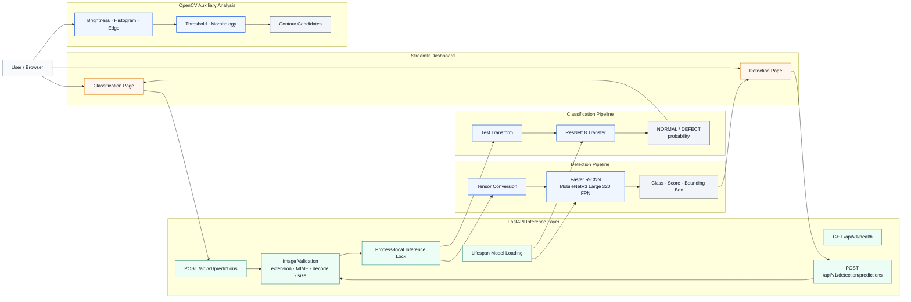
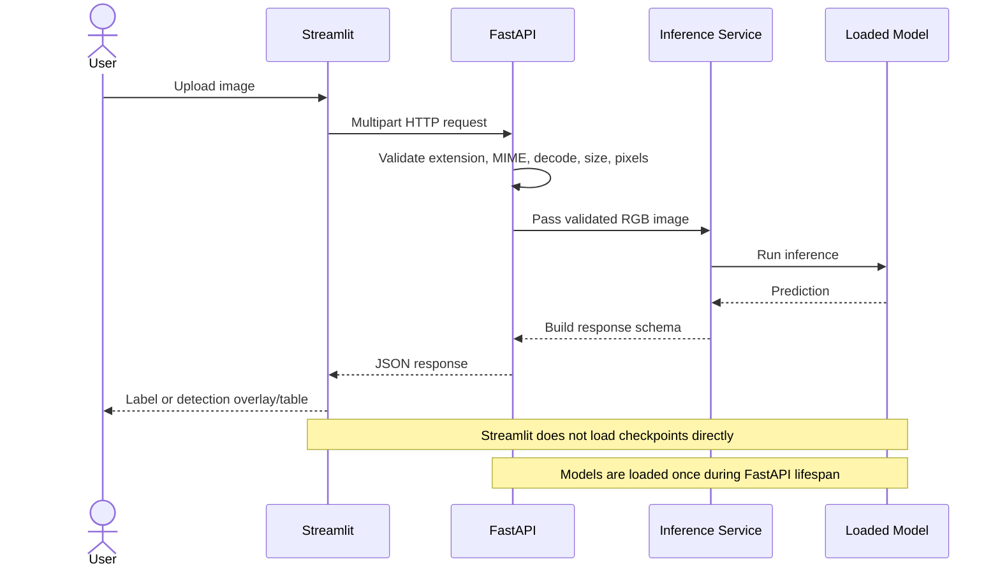

# 제조 표면 결함 Vision AI

**저장소 ID:** `manufacturing-vision-defect-analysis-system`

> **제조 이미지의 정상·불량 분류와 표면 결함 객체 탐지를
> 데이터 분석부터 PyTorch 모델, 실패 분석, FastAPI, Streamlit까지 연결한 Vision AI 프로젝트**

<p>
  
  
  
  
</p>

<p align="center">
  
</p>

[Profile](https://github.com/lightleaping) · [API](#7-api--dashboard-integration) · [Run](#10-how-to-run) · [Limitations](#12-limitations--next-steps)

---

## Recruiter Summary

| 구분 | 내용 |
|---|---|
| 기간 | **2026.07 · 14일 범위로 기획·구현·검증** |
| 형태 | 개인 프로젝트 · 1인 개발 |
| 목적 | 제조 이미지의 **전체 품질 상태**와 **개별 결함 종류·위치**를 서로 다른 모델로 분석 |
| 범위 | 데이터 분석 → 분류 → OpenCV 보조 분석 → 객체 탐지 → 실패 분석 → FastAPI → Streamlit |
| 내 역할 | 기획·데이터 분석·모델 개발·평가·시각화·API·Dashboard·테스트·문서화 전반 |
| 핵심 기술 | Python, PyTorch, torchvision, OpenCV, scikit-learn, FastAPI, Streamlit, pytest |

---

## Problem → Action → Evaluation

| Problem · 왜 필요한가 | Action · 어떻게 해결했는가 | Evaluation · 무엇으로 검증했는가 |
|---|---|---|
| 육안 검사만으로는 일관된 기준 유지가 어렵고, 전체 불량 여부만으로는 결함의 종류·위치를 알 수 없음 | ResNet18 분류와 Faster R-CNN 객체 탐지를 목적별 별도 파이프라인으로 구현 | Accuracy·Precision·Recall·F1·Confusion Matrix·mAP·IoU |
| 높은 전체 성능만으로 실제 실패 유형을 알기 어려움 | 분류 FP/FN과 검출 누락·위치 오류·중복·클래스 혼동을 수집·분석 | 오분류 19개, Detection Failure 5종 |
| 모델 결과가 Notebook에만 있으면 실제 입력 흐름을 확인하기 어려움 | 모델을 FastAPI에서 로드하고 Streamlit이 HTTP API를 호출하도록 분리 | Endpoint·Schema·HTTP·Dashboard·회귀 테스트 |

---

## 1. Why This Project

제조 품질 검사에서는 다음 질문이 서로 다릅니다.

1. **이미지 전체가 정상인가, 불량인가?**
2. **모델이 어떤 영역에 상대적으로 반응했는가?**
3. **어떤 결함이 어느 위치에 존재하는가?**
4. **모델 결과를 API와 사용자 화면에서 일관되게 제공할 수 있는가?**

하나의 모델이 모든 질문에 답하도록 과장하지 않고 역할을 분리했습니다.

| Pipeline | 역할 | 데이터 | 출력 |
|---|---|---|---|
| Classification | 이미지 전체 정상·불량 판정 | Casting Product Image Data | `NORMAL` / `DEFECT`, probability |
| OpenCV Analysis | 명암·경계·형태 특성 보조 분석 | Manufacturing Image | histogram, edge, threshold, morphology, contour candidates |
| Object Detection | 개별 결함 종류와 위치 탐지 | NEU Surface Defect | class, score, bounding box |

> OpenCV Contour는 Threshold와 Morphology에서 얻은 **후보 영역**이며, 정답 결함 위치나 Detection 결과로 취급하지 않습니다.
> Grad-CAM 역시 모델이 상대적으로 사용한 영역을 보는 **설명 보조 수단**이며, 실제 결함 위치의 정답 Mask가 아닙니다.

---

## 2. Key Results

### Classification

| Metric | CNN Baseline | ResNet18 Transfer | Improvement |
|---|---:|---:|---:|
| Accuracy | 76.92% | **97.34%** | **+20.42%p** |
| Precision | 82.88% | **97.17%** | **+14.29%p** |
| Recall | 80.13% | **98.68%** | **+18.54%p** |
| F1 Score | 81.48% | **97.92%** | **+16.44%p** |
| False Negative | 90 | **6** | **-84** |
| Total Errors | 165 | **19** | **-146** |

ResNet18 Test Confusion Matrix:

|  | Predicted NORMAL | Predicted DEFECT |
|---|---:|---:|
| Actual NORMAL | 249 | 13 |
| Actual DEFECT | 6 | 447 |

### Object Detection

| Metric | Test Result |
|---|---:|
| Precision | **0.812950** |
| Recall | **0.526807** |
| F1 | **0.639321** |
| mAP@0.50 | **0.707726** |
| Mean Matched IoU | **0.752338** |
| Project AP 0.50:0.95 | **0.310533** |

> `Project AP 0.50:0.95`는 프로젝트 내부 all-point interpolation 구현 결과이며 공식 COCOeval 수치와 동일하게 해석하지 않습니다.

### Verification

| Verification | Result |
|---|---:|
| FastAPI Endpoints | 3/3 PASS |
| Full Regression Tests | **1,737 passed** |
| Warning | 1 existing warning |
| Test Runtime | 100.56 seconds |

---

## 3. Visual Results

### Classification Failure Analysis


- Test images: 715
- Correct: 696
- Misclassified: 19
- False Positive: 13
- False Negative: 6
- Error Rate: 2.66%

### Grad-CAM


모델 반응 영역이 결함과 관련된 부분에 나타나는지, 배경이나 주변 패턴에 과도하게 의존하는지를 시각적으로 검토했습니다.

### Detection Prediction


### Detection Failure Analysis


### Dashboard Overlay


---

## 4. System Architecture



### Inference Request Flow



---

## 5. Data & Model Scope

### 5.1 Classification Dataset

| Item | Value |
|---|---:|
| Dataset | Casting Product Image Data for Quality Inspection |
| Total | 7,348 images |
| Train | 5,306 |
| Validation | 1,327 |
| Test | 715 |
| Image | 300×300 RGB |
| Target | `0=NORMAL`, `1=DEFECT` |

### 5.2 Classification Models

#### CNN Baseline

```text
Input
→ Conv(3→8) → ReLU → Pool
→ Conv(8→16) → ReLU → Pool
→ Conv(16→32) → ReLU → Pool
→ Adaptive Average Pool
→ Linear(32→1)
→ Raw Logit
```

- Parameters: 6,065
- Purpose: data pipeline·training loop·checkpoint·evaluation flow validation
- Best Validation Accuracy: 76.94%

#### ResNet18 Transfer Learning

```text
ImageNet Pretrained ResNet18
→ Frozen Backbone
→ Linear(512→1)
→ Raw Logit
```

- Total parameters: 11,177,025
- Trainable parameters: 513
- Best epoch: 5
- Best Validation Accuracy: 97.06%
- CPU training time: 44.05 minutes

### 5.3 Detection Dataset & Model

| Item | Value |
|---|---|
| Dataset | NEU Surface Defect |
| Images | 1,800 |
| Classes | 6 |
| Valid Boxes | 4,189 |
| Model | Faster R-CNN MobileNetV3 Large 320 FPN |
| Output | Class · Score · Bounding Box |
| Best Checkpoint | `day12_detection_best.pt`, epoch 2 |

---

## 6. Evaluation & Failure Analysis

### Classification

전역 지표만 보고 끝내지 않고 19개 오분류를 수집해 다음과 같이 구분했습니다.

- **False Positive**: 실제 정상 이미지를 불량으로 판단
- **False Negative**: 실제 불량 이미지를 정상으로 판단
- 예측 확률과 시각적 패턴을 함께 확인
- 제조 품질 검사에서 위험도가 큰 False Negative를 별도 검토

### Detection

다음 실패 유형을 구분했습니다.

| Failure Type | Meaning |
|---|---|
| Low Confidence | 결함 후보는 있으나 score가 낮음 |
| Missed Detection | 실제 결함을 찾지 못함 |
| Localization Error | 결함은 찾았지만 위치가 부정확함 |
| Duplicate Detection | 하나의 결함을 여러 Box로 중복 예측 |
| Class Confusion | 결함 위치는 찾았지만 Class가 다름 |

Recall이 Precision보다 낮은 결과를 통해, 현재 모델은 잘못된 Box를 과도하게 생성하기보다 **실제 결함 일부를 놓치는 문제**가 더 크다고 해석했습니다.

---

## 7. API · Dashboard Integration

### Endpoints

| Method | Endpoint | Role |
|---|---|---|
| GET | `/api/v1/health` | 모델·서비스 상태 확인 |
| POST | `/api/v1/predictions` | 정상·불량 분류 |
| POST | `/api/v1/detection/predictions` | 결함 Class·Score·Bounding Box |

### Classification Response

```json
{
  "prediction": "DEFECT",
  "defect_probability": 0.9999,
  "threshold": 0.5,
  "model": "resnet18_transfer"
}
```

### Detection Response

```json
{
  "detections": [
    {
      "class_name": "crazing",
      "score": 0.91,
      "box": [31.2, 48.5, 151.7, 176.9]
    }
  ]
}
```

### Integration Decision

- 모델은 FastAPI Lifespan에서 한 번 로드
- 요청마다 체크포인트를 재로딩하지 않음
- Streamlit은 모델을 직접 실행하지 않고 API Client로 호출
- 분류와 검출 Endpoint를 독립적으로 유지
- 실제 HTTP 요청으로 전체 흐름 검증

---

## 8. Project Structure

```text
manufacturing-vision-defect-analysis-system/
├── data/
├── models/
│   └── checkpoints/
├── reports/
│   ├── artifacts/
│   ├── figures/
│   └── day*_summary.md
├── scripts/
├── src/
│   ├── api/
│   ├── data/
│   ├── detection/
│   ├── evaluation/
│   ├── explainability/
│   ├── models/
│   ├── opencv_analysis/
│   ├── services/
│   └── training/
├── tests/
├── README.md
├── requirements.txt
└── pytest.ini
```

---

## 9. Development Schedule

| Day | Scope |
|---:|---|
| 1–2 | Classification data analysis·Dataset·DataLoader |
| 3–4 | CNN Baseline·ResNet18 training and evaluation |
| 5–6 | Misclassification analysis·Grad-CAM |
| 7–8 | Classification FastAPI·Streamlit |
| 9 | Detection dataset analysis |
| 10 | OpenCV auxiliary analysis |
| 11–12 | Detection model·training·evaluation·failure analysis |
| 13 | Detection FastAPI·Streamlit integration |
| 14 | Final integration·README·Portfolio·regression test |

짧은 제출 일정에 맞춰 먼저 범위를 고정하고, 기능별 구현과 검증 결과를 매일 문서로 남겼습니다.

---

## 10. How to Run

### Environment

| Item | Value |
|---|---|
| OS | Windows |
| Python | 3.11.9 |
| PyTorch | 2.12.0+cpu |
| Torchvision | 0.27.0+cpu |
| CUDA | False |

### Setup

```powershell
python -m venv .venv
.\.venv\Scripts\Activate.ps1
python -m pip install -r .\requirements.txt
python -m pip check
```

### FastAPI

```powershell
.\.venv\Scripts\python.exe -m uvicorn src.api.app:app --host 127.0.0.1 --port 8000
```

### Streamlit

```powershell
.\.venv\Scripts\python.exe -m streamlit run .\src\dashboard\app.py
```

> 실제 실행 모듈 경로가 저장소 최신 구조와 다를 경우 `README` 하단의 기존 실행 명령 또는 `scripts/`를 우선 확인하세요.

### Tests

```powershell
python -m pytest .\tests -q
```

---

## 11. Validation Scope

- Dataset configuration·split·transform·DataLoader
- CNN·ResNet18·Faster R-CNN model flow
- Checkpoint metadata and loading
- Accuracy·Precision·Recall·F1·Confusion Matrix
- Detection mAP·IoU·class metrics
- Misclassification·failure artifact generation
- Image validation and API schema
- FastAPI endpoint and HTTP integration
- Streamlit API client and overlay
- Final regression test

---

## 12. Limitations & Next Steps

### Current Limitations

- Detection Recall **0.526807**로 일부 결함 누락이 남아 있음
- 3 Epoch CPU 학습으로 충분한 수렴·하이퍼파라미터 탐색을 수행하지 못함
- Classification과 Detection은 서로 다른 데이터셋을 사용하므로 하나의 통합 정답으로 해석할 수 없음
- Grad-CAM은 결함 위치의 Ground Truth가 아닌 설명 보조 수단
- 브라우저 수동 확인 기록은 자동 테스트와 별도로 관리됨
- 운영 환경의 인증·모니터링·모델 버전 관리까지는 구현하지 않음

### Next Steps

1. Detection 학습 Epoch·Scheduler·Augmentation 비교
2. Class별 Recall과 누락 원인에 따른 Sampling 개선
3. COCOeval 기반 표준 AP 추가
4. 모델 버전·추론 로그·Latency 모니터링
5. 실제 제조 데이터의 Drift와 재학습 기준 설계

---

## 13. What This Project Demonstrates

- 제조 이미지 데이터를 학습 가능한 형태로 구성하는 능력
- Baseline과 전이학습 모델을 동일 기준으로 비교하는 능력
- Vision Classification과 Object Detection의 역할 차이를 설명하는 능력
- Accuracy뿐 아니라 Recall·F1·mAP·IoU와 실제 실패 사례를 분석하는 능력
- PyTorch 모델을 FastAPI·Streamlit 사용자 흐름으로 연결하는 능력
- 테스트와 문서로 실행 결과를 재현 가능하게 남기는 능력

---

## Contact

- Developer: 김수진
- GitHub: [github.com/lightleaping](https://github.com/lightleaping)
- Email: workingskyroad@gmail.com
---

## 개편 전 README 보존

적용 스크립트는 교체 전 README를 `docs/archive/README_before_encell.md`와 시간별 백업 파일로 보존합니다. 기존의 긴 개발 기록이나 실행 설명은 삭제하지 않고 해당 문서에서 계속 확인할 수 있습니다.
