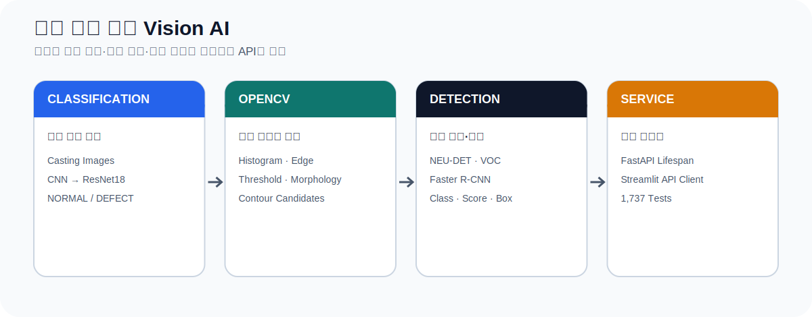
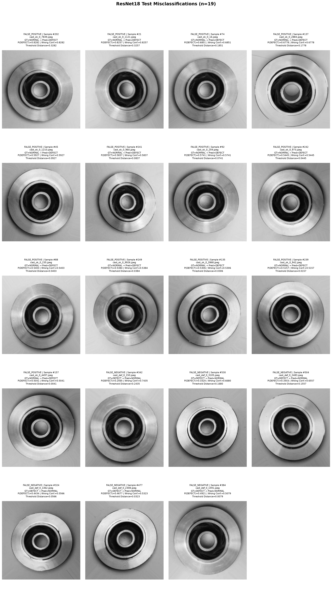
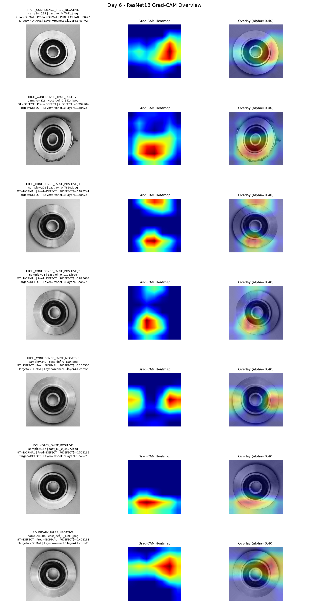
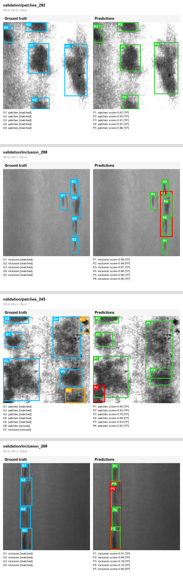
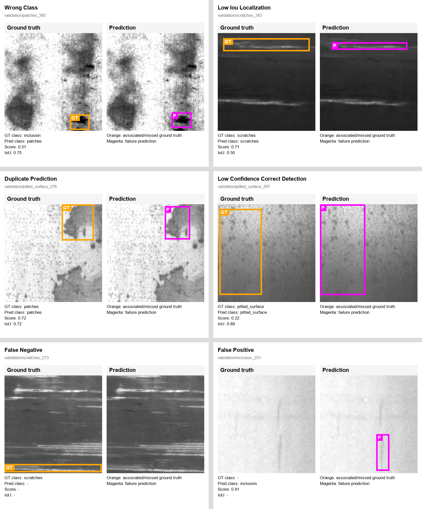
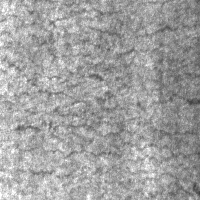
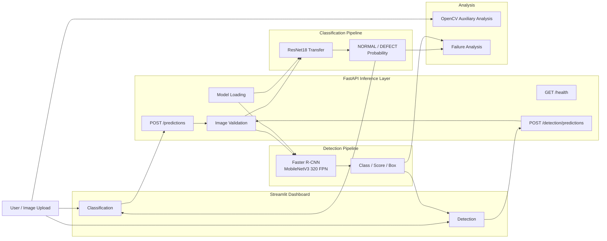

# 제조 표면 결함 Vision AI

> 제조 이미지의 정상·불량 분류와 표면 결함 객체 탐지를 구현하고, 모델 평가와 실패 사례 분석을 FastAPI·Streamlit 사용자 흐름까지 연결한 Vision AI 프로젝트입니다.

<p>
  
  
  
  
  
</p>



---

## Recruiter Overview

| 항목 | 내용 |
|---|---|
| **프로젝트 기간** | 2026.07 |
| **프로젝트 형태** | 개인 프로젝트 |
| **해결 문제** | 이미지 전체의 정상·불량 상태와 개별 표면 결함의 종류·위치를 서로 다른 모델로 분석 |
| **프로젝트 범위** | 이미지 데이터 분석, 분류 모델, 객체 탐지 모델, OpenCV 보조 분석, 성능 평가, 실패 사례 분석, FastAPI, Streamlit, 테스트, 문서화 |
| **핵심 기술** | Python, PyTorch, torchvision, ResNet18, Faster R-CNN, OpenCV, scikit-learn, FastAPI, Streamlit, pytest |
| **대표 결과** | DEFECT-class F1 97.92%, Detection mAP@0.50 0.7077, FastAPI Endpoint 3/3 PASS |

---

## Problem → Solution → Evaluation

| Problem | Solution | Evaluation |
|---|---|---|
| 이미지 전체의 불량 여부만으로는 개별 결함의 종류와 위치를 알기 어려움 | ResNet18 분류와 Faster R-CNN 객체 탐지를 목적별 파이프라인으로 분리 | Accuracy, Precision, Recall, F1, Confusion Matrix, mAP@0.50, IoU |
| 전체 성능 수치만으로는 모델이 어떤 사례에서 실패하는지 확인하기 어려움 | 분류 오분류와 객체 탐지 실패 사례를 유형별로 수집하고 시각화 | 분류 오분류 19개, 객체 탐지 실패 유형 5종 |
| 모델 결과가 학습 코드에만 머물면 실제 입력·응답 흐름을 확인하기 어려움 | FastAPI가 모델을 로드하고 Streamlit이 HTTP API로 결과를 요청하도록 구성 | Endpoint, Schema, HTTP Integration, Dashboard, Regression Test |

---

## Key Results

### Classification

| Metric | CNN Baseline | ResNet18 Transfer |
|---|---:|---:|
| Accuracy | 76.92% | **97.34%** |
| Precision | 82.88% | **97.17%** |
| Recall | 80.13% | **98.68%** |
| F1 Score | 81.48% | **97.92%** |
| False Negative | 90 | **6** |
| Total Errors | 165 | **19** |

> 분류 지표의 Precision, Recall, F1은 `DEFECT` Class를 기준으로 계산했습니다.

### Object Detection

| Metric | Test Result |
|---|---:|
| Precision | **0.812950** |
| Recall | 0.526807 |
| F1 | 0.639321 |
| mAP@0.50 | **0.707726** |
| Mean Matched IoU | **0.752338** |

### Service Verification

| Verification | Result |
|---|---:|
| FastAPI Endpoints | **3/3 PASS** |
| Full Regression Tests | **1,737 passed** |
| Test Runtime | 100.56 seconds |

---

## Visual Results

<table>
  <tr>
    <td width="50%" align="center">
      <b>Classification Failure Analysis</b><br><br>
      
    </td>
    <td width="50%" align="center">
      <b>Grad-CAM</b><br><br>
      
    </td>
  </tr>
  <tr>
    <td width="50%" align="center">
      <b>Detection Predictions</b><br><br>
      
    </td>
    <td width="50%" align="center">
      <b>Detection Failure Analysis</b><br><br>
      
    </td>
  </tr>
</table>

<p align="center">
  <b>Streamlit Detection Dashboard</b><br><br>
  
</p>

---

## System Architecture



### Design Decisions

- 분류와 객체 탐지는 서로 다른 질문에 답하므로 독립된 모델과 Endpoint로 구성했습니다.
- 모델은 FastAPI Lifespan에서 한 번 로드해 요청마다 Checkpoint를 다시 읽지 않도록 했습니다.
- Streamlit은 Checkpoint를 직접 로드하지 않고 FastAPI Client로 동작합니다.
- OpenCV Contour는 전처리 결과에서 얻은 후보 영역이며 객체 탐지 결과로 사용하지 않았습니다.
- Grad-CAM은 모델 반응 영역을 확인하는 보조 분석으로 사용했습니다.

---

## Project Details

<details open>
<summary><b>01 | Classification — CNN Baseline과 ResNet18 비교</b></summary>

<br>

### Dataset

| 항목 | 내용 |
|---|---:|
| Dataset | Casting Product Image Data for Quality Inspection |
| Total | 7,348 images |
| Train | 5,306 |
| Validation | 1,327 |
| Test | 715 |
| Target | NORMAL / DEFECT |

### Models

**CNN Baseline**

```text
Input
→ Conv(3→8) → ReLU → Pool
→ Conv(8→16) → ReLU → Pool
→ Conv(16→32) → ReLU → Pool
→ Adaptive Average Pool
→ Linear(32→1)
→ Raw Logit
```

- Parameters: 6,065
- 목적: Dataset, 학습 Loop, Checkpoint, 평가 흐름의 기준 모델 구성

**ResNet18 Transfer Learning**

```text
ImageNet Pretrained ResNet18
→ Frozen Backbone
→ Linear(512→1)
→ Raw Logit
```

- Total Parameters: 11,177,025
- Trainable Parameters: 513
- Best Validation Accuracy: 97.06%
- Test Accuracy: 97.34%

### Failure Analysis

Test 715장 중 19개 오분류를 다음과 같이 구분했습니다.

- False Positive: 13
- False Negative: 6
- Error Rate: 2.66%

제조 품질 판정에서 불량을 정상으로 판단하는 False Negative를 별도로 확인하고, 예측 확률과 이미지 패턴을 함께 검토했습니다.

</details>

<details>
<summary><b>02 | Object Detection — 6개 표면 결함 종류와 위치 탐지</b></summary>

<br>

### Dataset and Model

| 항목 | 내용 |
|---|---|
| Dataset | NEU Surface Defect |
| Images | 1,800 |
| Classes | 6 |
| Model | Faster R-CNN MobileNetV3 Large 320 FPN |
| Output | Class, Score, Bounding Box |
| Best Checkpoint | Epoch 2 |

### Failure Analysis

객체 탐지 결과를 다음 5개 유형으로 구분했습니다.

| Failure Type | 의미 |
|---|---|
| Low Confidence | 결함 후보를 찾았지만 Score가 낮은 사례 |
| Missed Detection | 실제 결함을 탐지하지 못한 사례 |
| Localization Error | 결함을 찾았지만 Bounding Box 위치가 부정확한 사례 |
| Duplicate Detection | 하나의 결함을 여러 Box로 예측한 사례 |
| Class Confusion | 위치는 찾았지만 결함 Class를 다르게 예측한 사례 |

Precision보다 Recall이 낮아 현재 모델에서는 과도한 오탐보다 일부 결함 누락을 줄이는 개선이 우선이라고 판단했습니다.

</details>

<details>
<summary><b>03 | OpenCV and Grad-CAM — 모델 결과를 보조하는 이미지 분석</b></summary>

<br>

### OpenCV Auxiliary Analysis

- Brightness와 Histogram
- Edge Detection
- Threshold
- Morphology
- Contour Candidate

OpenCV 분석은 이미지 상태와 형태적 특징을 확인하는 보조 과정입니다. Contour Candidate를 객체 탐지의 정답 위치나 Faster R-CNN 결과로 사용하지 않았습니다.

### Grad-CAM

ResNet18의 반응 영역이 결함과 관련된 부분에 나타나는지, 배경이나 주변 패턴에 과도하게 반응하는지를 시각적으로 확인했습니다.

Grad-CAM은 결함 위치의 Ground Truth가 아니라 모델 반응 영역을 확인하기 위한 설명 보조 수단입니다.

</details>

<details>
<summary><b>04 | FastAPI and Streamlit — 모델을 입력·응답 흐름으로 연결</b></summary>

<br>

### Endpoints

| Method | Endpoint | 역할 |
|---|---|---|
| GET | `/api/v1/health` | 모델과 서비스 상태 확인 |
| POST | `/api/v1/predictions` | 정상·불량 분류 |
| POST | `/api/v1/detection/predictions` | 결함 Class, Score, Bounding Box 반환 |

### Classification Response

```json
{
  "prediction": "DEFECT",
  "defect_probability": 0.9999,
  "threshold": 0.5,
  "model": "resnet18_transfer"
}
```

### Detection Response

```json
{
  "detections": [
    {
      "class_name": "crazing",
      "score": 0.91,
      "box": [31.2, 48.5, 151.7, 176.9]
    }
  ]
}
```

### Integration

```text
Image Upload
→ Streamlit API Client
→ FastAPI Validation
→ Loaded Model Inference
→ JSON Response
→ Prediction or Detection Overlay
```

</details>

<details>
<summary><b>05 | Validation — 모델·API·Dashboard 통합 검증</b></summary>

<br>

다음 범위를 pytest와 통합 실행으로 검증했습니다.

- Dataset Configuration, Split, Transform, DataLoader
- CNN, ResNet18, Faster R-CNN Model Flow
- Checkpoint Metadata and Loading
- Accuracy, Precision, Recall, F1, Confusion Matrix
- Detection mAP, IoU, Class Metrics
- Misclassification and Detection Failure Artifact
- Image Validation and API Schema
- FastAPI Endpoint and HTTP Integration
- Streamlit API Client and Overlay
- Final Regression Test

</details>

<details>
<summary><b>06 | Current Scope and Next Steps</b></summary>

<br>

### Current Scope

- Classification과 Detection은 목적과 데이터셋이 다른 독립 파이프라인입니다.
- Detection은 CPU 환경에서 3 Epoch 학습한 Checkpoint를 평가했습니다.
- Grad-CAM은 모델 반응 영역을 확인하는 보조 분석입니다.
- 공개 제조 이미지 데이터셋을 사용한 프로젝트입니다.

### Next Steps

1. Detection Epoch, Scheduler, Augmentation 비교
2. Class별 Recall과 누락 원인에 따른 Sampling 개선
3. COCOeval 기반 표준 AP 추가
4. 모델 Version, 추론 Log, Latency Monitoring
5. 실제 제조 데이터 환경을 고려한 Drift와 재학습 기준 설계

</details>

---

## Project Structure

```text
manufacturing-vision-defect-analysis-system/
├── data/
├── docs/
│   └── assets/
├── reports/
│   ├── artifacts/
│   ├── figures/
│   └── day*_summary.md
├── scripts/
├── src/
│   ├── api/
│   ├── dashboard/
│   ├── data/
│   ├── detection/
│   ├── evaluation/
│   ├── explainability/
│   ├── models/
│   ├── opencv_analysis/
│   ├── services/
│   └── training/
├── tests/
├── README.md
└── requirements.txt
```

---

## Run

### Environment

| 항목 | 내용 |
|---|---|
| OS | Windows |
| Python | 3.11.9 |
| PyTorch | 2.12.0+cpu |
| Torchvision | 0.27.0+cpu |
| CUDA | False |

### Setup

```powershell
python -m venv .venv
.\.venv\Scripts\Activate.ps1
python -m pip install -r .\requirements.txt
python -m pip check
```

### FastAPI

```powershell
.\.venv\Scripts\python.exe -m uvicorn src.api.app:app --host 127.0.0.1 --port 8000
```

### Streamlit

```powershell
.\.venv\Scripts\python.exe -m streamlit run .\src\dashboard\app.py
```

### Tests

```powershell
.\.venv\Scripts\python.exe -m pytest .\tests -q
```

---

## What This Project Demonstrates

- 제조 이미지 데이터를 PyTorch 학습 파이프라인으로 구성한 경험
- CNN Baseline과 ResNet18 전이학습을 동일한 평가 기준으로 비교한 경험
- 이미지 분류와 객체 탐지의 역할을 구분해 구현한 경험
- Accuracy뿐 아니라 Recall, F1, mAP, IoU와 실제 실패 사례를 함께 분석한 경험
- PyTorch 모델을 FastAPI와 Streamlit 사용자 흐름으로 연결한 경험
- 모델, API, Dashboard를 테스트하고 결과를 문서화한 경험

---

## Contact

- Developer: 김수진
- GitHub: [github.com/lightleaping](https://github.com/lightleaping)
- Email: workingskyroad@gmail.com
