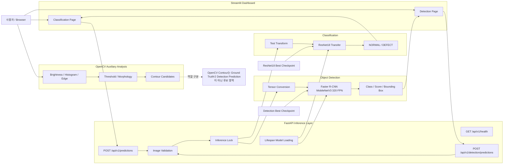
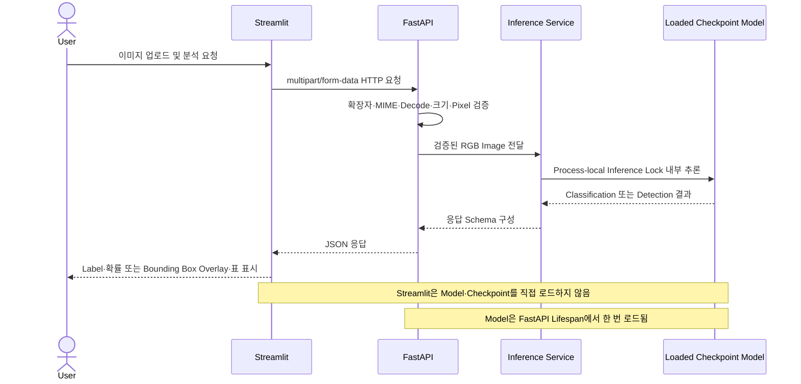

# Day 14 — Final Integration, README, Portfolio, and Interview Summary

## 1. Executive Summary

**Manufacturing Vision Defect Analysis System(제조 비전 결함 분석 시스템)**은 제조 이미지에 대해 전체 이미지 Classification, OpenCV 보조 분석, Object Detection을 제공하고 이를 FastAPI와 Streamlit으로 연결한 학습·제출용 프로젝트입니다.

Day 14에서는 새 모델을 추가하지 않고 Day 1~13 결과를 하나의 시스템 관점으로 통합했습니다. README, Architecture, 실행 방법, 성능, Failure Analysis, Portfolio 설명, 면접 답변을 실제 Artifact와 테스트 근거에 맞춰 정리했습니다.

## 2. Problem Situation

제조 이미지 검사에서 단일 결과만으로는 다음 질문을 모두 해결하기 어렵습니다.

1. 이미지 전체가 정상인지 불량인지
2. 밝기·경계·형태 특성은 어떤지
3. 어떤 결함이 어느 위치에 있는지
4. 모델 결과를 API와 Dashboard에서 어떻게 일관되게 제공할지

이 프로젝트는 세 분석 Pipeline을 역할별로 분리하고 하나의 서비스 구조로 연결했습니다.

## 3. Solution Architecture



### 호출 관계

1. 사용자가 Streamlit에 이미지를 업로드합니다.
2. Streamlit은 Model이나 Checkpoint를 직접 읽지 않고 FastAPI로 요청합니다.
3. FastAPI는 파일 확장자, MIME, Decode, 이미지 크기와 Pixel을 검증합니다.
4. Lifespan에서 한 번 로드한 Service가 Process-local Lock 내부에서 추론합니다.
5. FastAPI가 검증된 Response Schema를 반환합니다.
6. Streamlit이 Classification 결과 또는 Detection Overlay·표를 표시합니다.

## 4. End-to-End User Flow



## 5. Pipeline Boundaries

### Classification

- Dataset: Casting Product Image Data
- Label: `0=NORMAL`, `1=DEFECT`
- Model: ResNet18 Transfer Learning
- 역할: 이미지 전체의 정상·불량 판정
- 하지 않는 일: 결함 위치나 세부 결함 Class 반환

### OpenCV

- 밝기·표준편차·Histogram·Canny Edge·Threshold·Morphology 분석
- Contour는 Threshold·Morphology 기반 후보 영역
- Contour는 Ground Truth나 Detection Prediction이 아님
- 역할: 모델 결과를 대체하지 않는 보조 해석

### Object Detection

- Dataset: NEU Surface Defect Database
- Class: crazing, inclusion, patches, pitted_surface, rolled-in_scale, scratches
- Model: Faster R-CNN MobileNetV3 Large 320 FPN
- 역할: 결함 Class·Score·Bounding Box 예측
- Detection 0개: 현재 Score Threshold 이상 Prediction이 없다는 의미

## 6. Dataset and Training Summary

### Classification

| Split | Samples |
|---|---:|
| Train | 5,306 |
| Validation | 1,327 |
| Test | 715 |

- Best Validation Epoch: 5
- Best Validation Accuracy: 97.0610%
- Best Validation Loss: 0.1579
- Checkpoint: `models/checkpoints/resnet18_transfer_best.pt`

### Detection

| Split | Images | Boxes |
|---|---:|---:|
| Train | 1,440 | 3,335 |
| Validation | 178 | 425 |
| Test | 182 | 429 |
| Total | 1,800 | 4,189 |

- Best Checkpoint Epoch: 3
- Validation mAP@0.50: 0.677418
- Checkpoint: `models/detection/day12_detection_best.pt`
- Split Manifest: `data/processed/neu_det/splits.json`

## 7. Final Performance

| Pipeline | Model / Method | Test Result |
|---|---|---|
| Classification | ResNet18 Transfer | Accuracy 97.34%, Precision 97.17%, Recall 98.68%, F1 97.92% |
| Classification Confusion Matrix | Binary NORMAL/DEFECT | TN 249, FP 13, FN 6, TP 447 |
| Detection | Faster R-CNN MobileNetV3 Large 320 FPN | Precision 0.812950, Recall 0.526807, F1 0.639321 |
| Detection Localization | IoU 0.50 Evaluation | Mean matched IoU 0.752338, mAP@0.50 0.707726 |
| Detection Project AP | Project all-point interpolation | AP 0.50:0.95 0.310533 |
| Detection Best Class | patches | F1 0.841026, AP@0.50 0.888495 |
| Detection Weak Class | crazing | Recall 0.025316, F1 0.048780, AP@0.50 0.522723 |

### Metric Boundary

- `mAP@0.50`은 IoU 0.50 기준 Class별 AP 평균입니다.
- `AP 0.50:0.95`는 프로젝트 내부 all-point interpolation 구현입니다.
- 공식 COCOeval 결과로 표현하지 않습니다.
- Classification과 Detection은 Dataset·Label·목적이 다르므로 직접 우열 비교하지 않습니다.

## 8. Detection Failure Analysis

- Test Images: 182
- Failure가 하나 이상 있는 이미지: 129
- 전체 Failure Event: 229

| Failure Type | Count | Interpretation |
|---|---:|---|
| Low-confidence correct match | 140 | 위치와 Class는 맞지만 운영 Threshold보다 Score가 낮음 |
| False Negative | 37 | Ground Truth와 일치하는 Prediction이 없음 |
| Low IoU | 25 | Class는 맞을 수 있으나 위치 겹침이 기준 미달 |
| False Positive | 23 | 대응되는 Ground Truth가 없는 Prediction |
| Duplicate | 3 | 하나의 Ground Truth에 중복 Prediction |
| Wrong Class | 1 | 위치가 겹치지만 Class가 다름 |

### 핵심 해석

- 가장 많은 유형은 Low-confidence correct match 140건입니다.
- Score Threshold가 False Negative처럼 보이는 결과에 큰 영향을 줍니다.
- `crazing`은 가늘고 갈라진 형태 때문에 Recall이 특히 낮았습니다.
- 단순 Threshold 하향은 Recall을 높일 수 있지만 False Positive 증가 위험이 있습니다.
- 개선 우선순위는 Data Augmentation, Class 균형, 작은 결함 보존, Class별 Threshold 검토입니다.

## 9. API and Dashboard

| Method | Endpoint | Output |
|---|---|---|
| GET | `/api/v1/health` | Service·Checkpoint 상태 |
| POST | `/api/v1/predictions` | Classification Label·Probability |
| POST | `/api/v1/detection/predictions` | Detection Class·Score·Bounding Box |

### 설계 결정

- FastAPI Lifespan에서 Classification·Detection Service를 한 번 로드
- CPU `map_location`과 Checkpoint Metadata 검증
- Process-local Inference Lock으로 동시 추론 안전성 확보
- Streamlit은 API Client 역할만 담당
- Dashboard가 Torch·Model Factory·Checkpoint를 직접 사용하지 않도록 경계 설정

## 10. Run Guide

### FastAPI

```powershell
.\.venv\Scripts\python.exe `
    -m uvicorn `
    src.api.app:app `
    --host 127.0.0.1 `
    --port 8000
```

### Streamlit

별도 PowerShell 창에서 실행합니다.

```powershell
.\.venv\Scripts\python.exe `
    -m streamlit `
    run `
    .\src\dashboard\app.py
```

### Tests

```powershell
.\.venv\Scripts\python.exe `
    -m pytest `
    -q
```

## 11. Validation Result

| Verification | Result |
|---|---|
| Day 14 Targeted Tests | 69 passed |
| Full Regression | 1737 passed |
| Warning | 1 |
| Full Regression Runtime | 100.56 seconds |
| Final Integration Prerequisites | PASS |
| Final Integration Evidence | PASS |
| FastAPI Expected Endpoints | 3/3 PASS |
| Day 13 API Core Context UTF-8 Rebuild | PASS |
| Manual Browser Check | not_recorded |

수동 Browser 상태는 자동 HTTP·API Client·Overlay 검증과 분리합니다. 실제 수동 기록이 없으므로 `not_recorded`를 유지합니다.

## 12. Key Design Decisions

### 문제 상황

Classification·OpenCV·Detection이 같은 이미지 분석 영역을 다루지만 역할과 출력이 달라 혼동될 수 있었습니다.

### 해결 방안과 고민

- 각 Pipeline의 Dataset·Label·Output을 분리했습니다.
- Streamlit에 Model 로딩 책임을 두지 않고 FastAPI에 추론 책임을 집중했습니다.
- Detection 평가는 Global Metric과 Class별 Metric, Failure Event를 함께 봤습니다.
- 공식 COCOeval이 아닌 내부 AP 구현은 명확하게 구분했습니다.
- 자동 검증과 수동 Browser 확인을 동일하게 취급하지 않았습니다.

### 적용

- Lifespan Model Loading
- Input Validation
- Inference Lock
- API Client Boundary
- Checkpoint Metadata Validation
- JSON Artifact 기반 문서 생성
- Regression Test 기반 완료 기준

### 효과와 의미

- 모델·API·Dashboard의 호출 관계를 설명할 수 있습니다.
- 성능 수치의 출처와 한계를 추적할 수 있습니다.
- Classification·Detection의 실패를 서로 다른 관점으로 분석할 수 있습니다.
- AI 보조 도구로 초안을 만들더라도 실제 실행·테스트·수정·문서화로 결과를 검증하는 개발 방식을 보여줍니다.

## 13. Portfolio Summary

### 프로젝트 설명

제조 이미지의 정상·불량 Classification, OpenCV 기반 이미지 특성 분석, 6개 철강 표면 결함 Object Detection을 구현하고 FastAPI·Streamlit으로 통합한 제조 비전 결함 분석 시스템입니다.

### 주요 구현

- PyTorch Dataset·DataLoader·Transform·Stratified Split
- CNN Baseline과 ResNet18 Transfer Learning
- Accuracy·Precision·Recall·F1·Confusion Matrix 평가
- 오분류 분석과 Grad-CAM
- OpenCV Histogram·Edge·Threshold·Morphology·Contour 분석
- Pascal VOC 기반 NEU-DET Dataset과 Faster R-CNN
- Detection mAP·IoU·Class별 AP·Failure Analysis
- FastAPI Lifespan·Input Validation·Inference Lock
- API Client 전용 Streamlit Dashboard
- Artifact·README·Regression Test 자동 검증

### 성과

- Classification Test F1: 97.92%
- Detection Test mAP@0.50: 0.707726
- Detection Mean matched IoU: 0.752338
- FastAPI 예상 Endpoint 3개 검증
- Day 14 최종 통합 사전 점검·근거 수집 PASS
- 전체 회귀 테스트: 1737 passed

## 14. Interview Guide

### Q1. 왜 Classification과 Detection을 모두 구현했나요?

Classification은 이미지 전체가 정상인지 불량인지 빠르게 판단하지만 위치와 결함 종류를 설명하지 못합니다. Detection은 결함 종류와 위치를 제공하지만 데이터 Annotation과 연산 비용이 더 큽니다. 두 문제를 분리해 구현하면서 제조 Vision 서비스에서 목적에 따라 모델을 선택하는 기준을 학습했습니다.

### Q2. OpenCV Contour와 Detection Bounding Box의 차이는 무엇인가요?

OpenCV Contour는 Threshold와 Morphology 결과에서 얻은 후보 영역입니다. 학습된 Class 의미가 없고 Ground Truth도 아닙니다. Detection Bounding Box는 Annotation을 이용해 학습한 모델의 Class·Score·위치 예측입니다.

### Q3. Streamlit에서 모델을 직접 로드하지 않은 이유는 무엇인가요?

UI와 추론 책임을 분리하기 위해서입니다. FastAPI가 Checkpoint·Transform·추론을 관리하고 Streamlit은 HTTP Client 역할만 담당하면 중복 로딩을 방지하고 API 단독 검증과 다른 Client 확장이 쉬워집니다.

### Q4. Detection Recall이 낮은 이유를 어떻게 분석했나요?

Global Metric만 보지 않고 229개 Failure Event를 유형별로 분해했습니다. Low-confidence correct match가 140건으로 가장 많았고, 특히 `crazing`의 Recall이 0.025316으로 낮았습니다. Threshold, 작은 결함 표현, Class 불균형과 형태 특성을 개선 후보로 정리했습니다.

### Q5. Detection AP 0.50:0.95를 COCO mAP라고 부르지 않는 이유는 무엇인가요?

프로젝트 구현은 여러 IoU Threshold에서 계산한 all-point interpolation AP 평균입니다. COCOeval의 세부 설정과 완전히 동일하다고 검증하지 않았으므로 `Project AP 0.50:0.95`로 구분합니다.

### Q6. Checkpoint 로딩에서 무엇을 검증했나요?

CPU 환경에서 `map_location`을 사용하고 Architecture, Class 수, Class Mapping, Image Size, Score Threshold 같은 Metadata가 현재 설정과 맞는지 검증했습니다. 불일치한 Checkpoint로 조용히 잘못 추론하는 문제를 방지했습니다.

### Q7. 프로젝트를 어떻게 검증했나요?

기능 단위 테스트, API TestClient, 실제 Best Checkpoint Smoke Test, Dashboard API Client·Overlay 검증, 구조 Inspector, Evidence Collector, 전체 Regression Test를 단계적으로 실행했습니다.

### Q8. AI 도구를 어떻게 사용했나요?

초안과 반복 작업에는 AI 보조 도구를 활용했지만, 코드는 직접 실행하고 오류를 수정했으며 Artifact·Checkpoint·응답 Schema·테스트 결과를 기준으로 문서화했습니다. 핵심은 생성된 결과를 그대로 사용하는 것이 아니라 실행·검증·수정·설명 가능한 상태로 만드는 것입니다.

## 15. Limitations

- CPU 환경 중심으로 학습·검증해 대규모 Hyperparameter Search를 수행하지 못했습니다.
- NEU-DET 규모가 작고 Class별 형태 차이가 큽니다.
- Detection Recall과 `crazing` 성능이 낮습니다.
- Project AP 0.50:0.95는 공식 COCOeval 결과가 아닙니다.
- Day 13 수동 Browser 확인 상태는 `not_recorded`입니다.
- 현재 Inference Lock은 Process-local이므로 Multi-worker 전역 Lock이 아닙니다.
- 실시간 생산 설비·카메라·PLC와 연결한 현장 배포 검증은 범위에 포함하지 않았습니다.

## 16. Future Improvements

1. 작은 결함 보존을 위한 고해상도·Tile 기반 Detection
2. Class-balanced Sampling과 결함별 Augmentation
3. Class별 Confidence Threshold Calibration
4. Precision-Recall Curve 기반 운영 Threshold 선택
5. COCOeval을 이용한 표준 Detection 평가 추가
6. Browser E2E 자동화와 수동 Visual Validation 기록
7. Docker·CI·Model Registry·Monitoring 확장

## 17. Completion Statement

Day 14는 새 기능 추가보다 **전체 흐름의 연결·검증·문서화**에 집중했습니다. Classification·OpenCV·Detection의 역할, FastAPI·Streamlit 호출 경계, 실제 성능과 실패 사례, 지표의 한계를 하나의 설명 가능한 프로젝트로 정리했습니다.
