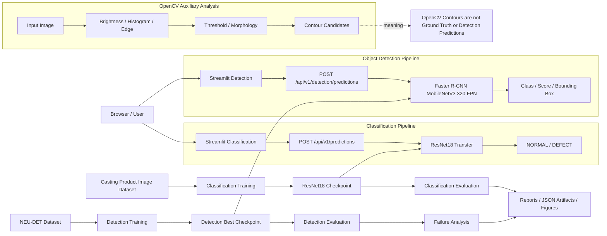
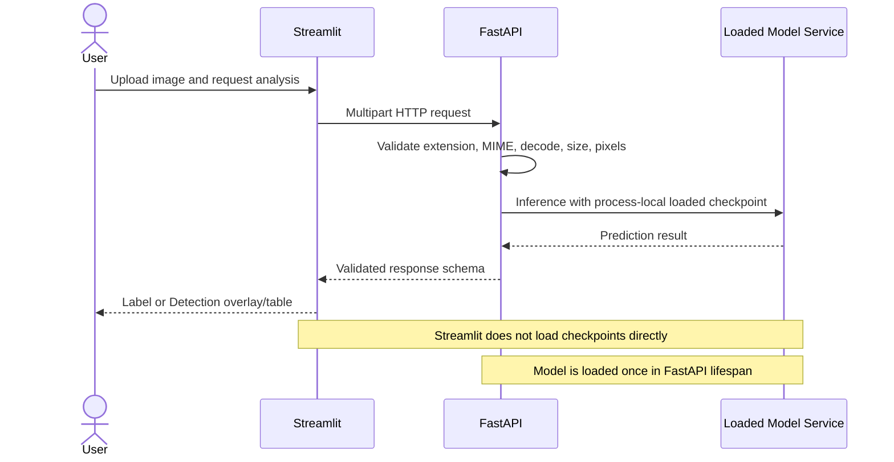

# Day 14 — Final Integration README and Architecture Plan

> 이 문서는 현재 저장소와 기존 Artifact를 읽어 생성한 **README 수정 전 근거 문서**다.
> README 자체와 Application Source는 수정하지 않았다.

## 1. Evidence Summary

- 프로젝트: **Manufacturing Vision Defect Analysis System**
- 한글명: **제조 비전 결함 분석 시스템**
- README Heading 수: **74**
- README Marker 수: **20**
- Report 수: **14**
- Artifact 수: **41**
- Figure 수: **22**
- Source 파일 수: **168**
- Test 파일 수: **107**
- Script 파일 수: **50**

## 2. Existing README Headings

- L1: # Manufacturing Vision Defect Analysis System
- L11: ## 1. Project Overview
- L75: ## 2. Current Implementation Status
- L77: ### Completed
- L137: ### Planned
- L161: ## 3. Binary Classification Definition
- L189: ## 4. Dataset
- L229: ## 5. Dataset Summary
- L251: ## 6. Train·Validation·Test Split
- L284: ## 7. Image Preprocessing
- L316: ### Train Transform
- L338: ### Validation·Test Transform
- L358: ## 8. PyTorch Data Pipeline
- L405: ## 9. CNN Baseline
- L511: ## 10. Why Raw Logits?
- L576: ## 11. Loss Function
- L602: ## 12. Optimizer
- L644: ## 13. Training Pipeline
- L724: ## 14. Best Model Selection
- L747: ## 15. CNN Baseline Training Result
- L793: ## 16. Training Result Analysis
- L845: ## 17. Best Checkpoint
- L927: ## 18. Test Evaluation Pipeline
- L1009: ## 19. CNN Baseline Test Result
- L1075: ## 20. Confusion Matrix
- L1117: ## 21. Metric Interpretation
- L1119: ### Accuracy
- L1137: ### Precision
- L1163: ### Recall
- L1205: ### F1 Score
- L1217: ## 22. Validation·Test Comparison
- L1246: ## 23. Majority Class Baseline Comparison
- L1302: ## 24. Probability Summary
- L1324: ## 25. CNN Baseline Summary
- L1361: ## 26. Generated Artifacts
- L1432: ## 27. Project Structure
- L1497: ## 28. Environment
- L1520: ## 29. Installation
- L1549: ## 30. Run CNN Baseline Training
- L1578: ## 31. Run CNN Baseline Test Evaluation
- L1602: ## 32. Run Tests
- L1704: ## 33. Design Principles
- L1706: ### Evidence-based Evaluation
- L1730: ### Validation before Test
- L1754: ### Separation of Responsibilities
- L1802: ### Reproducibility
- L1814: ## 34. Current Limitations
- L1852: ## 35. Next Step
- L1912: ## 36. Portfolio Summary
- L1962: ## 37. AI Tool Usage
- L2010: ## Day 4 — ResNet18 Transfer Learning
- L2015: ### Architecture
- L2036: ### Training Result
- L2046: ### Test Result
- L2074: ### Artifacts
- L2084: ### Tests
- L2096: ## Day 5 — ResNet18 Misclassified Image Analysis
- L2169: ## Day 6 — ResNet18 Grad-CAM Explainability
- L2175: ### 핵심 설계
- L2227: ## Day 7 — FastAPI Image Inference API
- L2233: ### Endpoint
- L2242: ### Inference Flow
- L2260: ### Validation Policy
- L2270: ### Real HTTP Validation
- L2313: ## Day 8 — Streamlit Image Inference Dashboard
- L2318: ### Architecture
- L2334: ### Dashboard Features
- L2347: ### Real Validation
- L2397: ## Day 9 — Object Detection Dataset Analysis
- L2406: ### 실제 분석 결과
- L2437: ## Day 10 — OpenCV Image Analysis Pipeline
- L2459: ## Day 11 — Detection Dataset and Model Implementation
- L2488: ## Day 12 — Detection Training, Evaluation and Failure Analysis
- L2516: ## Day 13 — Detection FastAPI and Streamlit Integration

## 3. README Final Structure Proposal

1. Project Overview
2. Problem Definition
3. Why This Project
4. Core Features
5. System Architecture
6. End-to-End User Flow
7. Project Structure
8. Environment
9. Dataset
10. Classification Pipeline
11. OpenCV Analysis Pipeline
12. Object Detection Pipeline
13. FastAPI Endpoints
14. Streamlit Dashboard
15. Model Training Policy
16. Evaluation Results
17. Failure Analysis
18. Validation and Testing
19. How to Run
20. Key Design Decisions
21. Limitations
22. Future Improvements
23. Portfolio Summary

### 정리 원칙

- 기존 Day 1~13 Marker는 제거하거나 중복 생성하지 않는다.
- Classification과 Detection의 Dataset·Label·Model·지표를 분리한다.
- OpenCV Contour는 Ground Truth 또는 Detection Prediction으로 표현하지 않는다.
- Detection의 `Project mAP@0.50:0.95`는 프로젝트 내부 all-point AP로 설명한다.
- 수동 Browser 검증은 실제 기록이 없으면 `not_recorded`로 유지한다.
- 최종 테스트 수는 마지막 전체 회귀 테스트 출력 후 반영한다.

## 4. System Architecture



## 5. End-to-End User Flow



## 6. Verified FastAPI Endpoints

- `POST /api/v1/detection/predictions` — `src/api/app.py:228`
- `GET /api/v1/health` — `src/api/app.py:143`
- `POST /api/v1/predictions` — `src/api/app.py:170`

## 7. Classification·OpenCV·Detection Role Boundary

### Classification

- 입력 이미지 전체를 `NORMAL / DEFECT`로 분류한다.
- 결함 위치나 세부 결함 Class는 반환하지 않는다.
- Casting Product Image Dataset과 ResNet18 Checkpoint를 사용한다.

### OpenCV

- 이미지의 명암·히스토그램·경계·Threshold·Morphology 특성을 분석한다.
- Contour는 Threshold·Morphology 기반 후보 영역이다.
- Contour는 Ground Truth도 Detection Prediction도 아니다.

### Detection

- NEU-DET 이미지에서 결함 Class·Score·Bounding Box를 예측한다.
- Faster R-CNN MobileNetV3 Large 320 FPN Checkpoint를 사용한다.
- Detection Prediction은 Ground Truth가 아니다.
- Detection 0개는 현재 Threshold 이상 Prediction이 없다는 의미다.

## 8. Selected Evidence Artifacts

### classification_evaluation

- `reports/artifacts/day4_resnet18_test_evaluation.json`
### detection_evaluation

- `reports/artifacts/day12_detection_evaluation.json`
### detection_failure_analysis

- `reports/artifacts/day12_detection_failure_analysis.json`
### day13_api_smoke

- `reports/artifacts/day13_detection_api_smoke_test.json`
### day13_dashboard_validation

- `reports/artifacts/day13_detection_dashboard_api_client_validation.json`
### day13_integration_summary

- `reports/artifacts/day13_detection_integration_summary.json`

## 9. Static Run Command Plan

### 전체 테스트

정적 경로 확인: `PASS`

```powershell
.\.venv\Scripts\python.exe `
    -m pytest `
    -q
```
### FastAPI

정적 경로 확인: `PASS`

```powershell
.\.venv\Scripts\python.exe `
    -m uvicorn `
    src.api.app:app `
    --host 127.0.0.1 `
    --port 8000
```
### Classification Dashboard

정적 경로 확인: `PASS`

```powershell
.\.venv\Scripts\python.exe `
    -m streamlit `
    run `
    .\src\dashboard\app.py
```
### Detection Dashboard

정적 경로 확인: `PASS`

```powershell
.\.venv\Scripts\python.exe `
    -m streamlit `
    run `
    .\src\dashboard\app.py
```

Streamlit Multipage 구조이므로 app.py 실행 후 Detection 페이지를 선택한다.

## 10. README Modification Gate

다음 항목이 모두 충족된 뒤 README를 수정한다.

- [ ] Classification 최종 평가 Artifact의 실제 키와 수치 확정
- [ ] Detection 평가·Failure Analysis Artifact의 실제 키와 수치 확정
- [ ] Day 13 API·Dashboard 검증 상태 확정
- [ ] 실행 Command 정적 경로 확인
- [ ] Architecture와 User Flow 표현 검토
- [ ] Portfolio·이력서·면접 문구 작성
- [ ] Day 14 대상 테스트 실행
- [ ] 전체 회귀 테스트 실행
- [ ] 마지막 전체 회귀 테스트 수로 README 최종 갱신

## 11. Current Safety Status

- README 수정: **아니오**
- 기존 Source 수정: **아니오**
- 모델 학습·추론 실행: **아니오**
- 기존 Checkpoint 변경: **아니오**
- 신규 Dependency: **없음**
