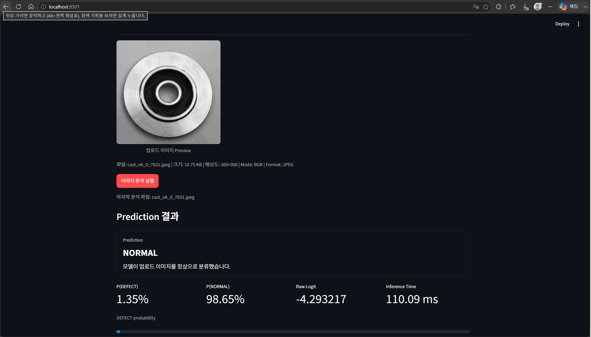
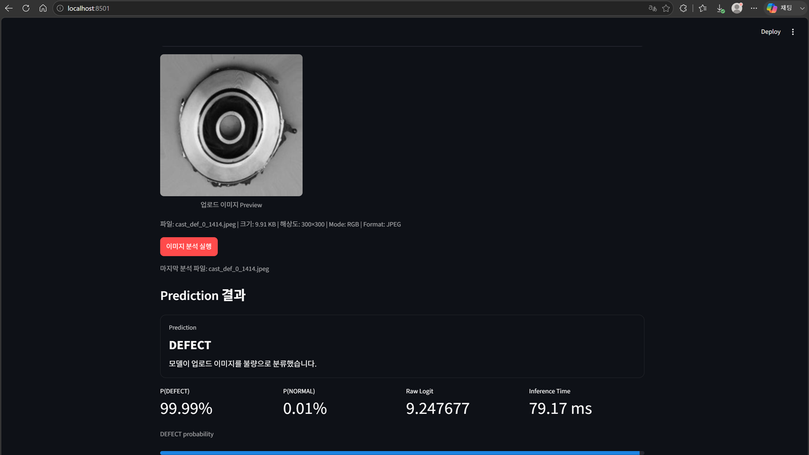

# Day 8 — Streamlit Image Inference Dashboard

## 1. 프로젝트

```text
영문: Manufacturing Vision Defect Analysis System
한글: 제조 비전 결함 분석 시스템
```

Day 8의 목표는 사용자가 브라우저에서 제조 이미지를 업로드하고, Day 7
FastAPI를 통해 `NORMAL` 또는 `DEFECT` 추론 결과를 확인할 수 있는 단일 페이지
Streamlit Dashboard를 구현하는 것이다.

---

## 2. 책임 분리

```text
사용자 브라우저
→ Streamlit Dashboard
→ DashboardApiClient
→ Day 7 FastAPI
→ ResNet18Transfer
→ Prediction JSON
→ Streamlit Session State
→ 결과 표시
```

FastAPI는 모델 로딩·이미지 검증·전처리·추론·오류 응답을 담당한다.
Streamlit은 이미지 업로드·Preview·HTTP 요청·결과 표시·사용자 경험만 담당한다.
Streamlit 내부에서는 Checkpoint를 직접 로딩하거나 확률을 다시 계산하지 않는다.

---

## 3. 구현 파일

```text
src/dashboard/__init__.py
src/dashboard/config.py
src/dashboard/api_client.py
src/dashboard/session_state.py
src/dashboard/styles.py
src/dashboard/ui_helpers.py
src/dashboard/app.py

scripts/inspect_day8_dashboard_prerequisites.py
scripts/update_day8_requirements.py
scripts/run_day8_dashboard_validation.py
scripts/finalize_day8_visual_validation.py
scripts/create_day8_docs.py
```

핵심 책임:

- 환경변수 기반 FastAPI Base URL과 Timeout 설정
- Dataclass 기반 Health·Prediction 결과
- `httpx.Client` 기반 Health·multipart Prediction 요청
- FastAPI 공통 오류 Schema의 안전한 해석
- 5초 TTL Health Cache
- Streamlit rerun을 고려한 Session State
- 업로드 이미지 Preview와 Metadata
- Prediction Card·확률 Metric·Progress·모델 Metadata
- 내부 예외 문자열과 Stack Trace 비노출

---

## 4. Dashboard 화면

```text
상단 프로젝트 설명
FastAPI 연결·Model Loaded·Device 상태
JPEG·PNG 이미지 업로더
업로드 이미지 Preview
파일명·크기·Mode Metadata
이미지 분석 실행 버튼
Prediction Card
P(DEFECT)·P(NORMAL)
Raw Logit·Inference Time
DEFECT Probability Progress
Model·Image Metadata
모델 한계와 Grad-CAM 분리 안내
```

버튼을 누르기 전에는 Prediction 요청을 전송하지 않는다. Health 요청만 짧게
Cache하며, Prediction 결과와 오류는 Session State에 저장해 Widget rerun 중에도
불필요하게 사라지지 않도록 했다.

---

## 5. API Client와 오류 정책

Client 검증 범위:

```text
Health 200
Prediction 200 NORMAL
Prediction 200 DEFECT
Timeout
Connection Error
FastAPI 오류 Schema
잘못된 JSON
필수 Key 누락
NaN·Infinity
확률 합 오류
Prediction·Class Name 불일치
Threshold 정책 불일치
```

Dashboard 오류 코드:

```text
API_CONNECTION_ERROR
API_TIMEOUT
API_INVALID_RESPONSE
API_REQUEST_ERROR
MODEL_NOT_READY
INVALID_IMAGE
UNSUPPORTED_FILE_TYPE
FILE_TOO_LARGE
IMAGE_TOO_LARGE
INFERENCE_FAILED
```

FastAPI가 반환한 내부 예외 문자열은 화면에 그대로 노출하지 않고, 사전에 정의한
안전한 사용자 메시지로 변환한다.

---

## 6. 실제 FastAPI 통합 검증

Health:

```text
Status       : ok
Model Loaded : True
Model        : ResNet18Transfer
Device       : cpu
Base URL     : http://127.0.0.1:8000
```

NORMAL 이미지:

```text
File         : cast_ok_0_7631.jpeg
Prediction   : NORMAL
P(DEFECT)    : 0.013476800174
P(NORMAL)    : 0.986523199826
Display      : 1.35% DEFECT
Raw Logit    : -4.293217182159
Inference    : 261.79 ms
```

DEFECT 이미지:

```text
File         : cast_def_0_1414.jpeg
Prediction   : DEFECT
P(DEFECT)    : 0.999903678894
P(NORMAL)    : 0.000096321106
Display      : 99.99% DEFECT
Raw Logit    : 9.247676849365
Inference    : 166.83 ms
```

통합 검증 Runtime:

```text
3.62 seconds
```

Artifact:

```text
reports/artifacts/day8_streamlit_dashboard_validation.json
```

---

## 7. 브라우저 육안 검증과 Screenshot

```text
UI Visual Validation : PASS
NORMAL Screenshot     : reports/figures/day8_streamlit_dashboard_normal.png
NORMAL Screenshot Size: 1704 × 974
DEFECT Screenshot     : reports/figures/day8_streamlit_dashboard_defect.png
DEFECT Screenshot Size: 1704 × 961
```





Screenshot은 실제 Streamlit 브라우저 화면에서 이미지 Preview, FastAPI 상태,
Prediction 결과와 확률이 함께 표시되는지 확인한 뒤 저장했다.

---

## 8. Dependency

```text
Streamlit : 1.59.2
httpx     : 0.28.1
Pillow    : 12.3.0
FastAPI   : 0.139.1
Pydantic  : 2.13.4
PyTorch   : 2.12.0+cpu
```

---

## 9. 테스트

초기 Dashboard 구현 테스트:

```text
45 passed
```

최종 전체 회귀 테스트:

```text
1315 passed
Warnings: 1건 — 실패와 분리하여 기술부채로 추적
```

테스트는 실제 FastAPI 서버나 Checkpoint에 의존하지 않도록 `httpx.MockTransport`와
Streamlit `AppTest`를 사용했다. 실제 모델과 Dataset 이미지는 별도의 통합 검증
Script에서만 사용했다.

---

## 10. 실행 방법

Terminal 1 — FastAPI:

```powershell
python -m uvicorn `
    src.api.app:app `
    --host 127.0.0.1 `
    --port 8000
```

Terminal 2 — Streamlit:

```powershell
python -m streamlit run `
    .\src\dashboard\app.py
```

실제 Client 통합 검증:

```powershell
python -m scripts.run_day8_dashboard_validation
```

육안 검증 Artifact 확정:

```powershell
python -m scripts.finalize_day8_visual_validation
```

---

## 11. 현재 범위와 향후 확장

현재 구현:

- 단일 이미지 정상·불량 분류 UI
- FastAPI Client 기반 책임 분리
- JPEG·PNG Preview
- Health·Model Loaded 상태
- Prediction·확률·Raw Logit·Metadata 표시
- Session State
- 안전한 오류 메시지
- NORMAL·DEFECT 브라우저 Screenshot

향후 확장 가능 범위:

- 별도 Grad-CAM Explain Endpoint와 Dashboard 연결
- Batch Upload
- Prediction History
- 모델 버전 선택
- 운영 Metric과 구조화 Logging
- 배포 환경별 Base URL 관리

Day 8에서는 일반 Prediction과 Grad-CAM을 합치지 않았다. Grad-CAM은 Gradient와
Hook이 필요한 별도 설명 가능성 작업이므로, 빠른 기본 추론 화면과 분리하는 것이
현재 범위에 적합하다.

---

## 12. 실무 포인트

1. UI와 모델 추론 서버의 책임을 분리했다.
2. Dashboard가 FastAPI 응답을 신뢰하기 전에 Schema 일관성을 검증한다.
3. 확률을 UI에서 재계산하지 않아 Backend와 표시 결과의 불일치를 방지한다.
4. Health 요청만 짧게 Cache하고 Prediction은 버튼 클릭 시에만 실행한다.
5. Session State로 Streamlit rerun 중 결과를 유지한다.
6. 단위 테스트는 Mock Transport를 사용하고 실제 모델은 통합 검증에서만 사용한다.
7. 브라우저 Screenshot까지 확보해 코드뿐 아니라 실제 동작 화면을 증명한다.
8. 모델 결과가 실제 생산 공정의 최종 판정을 대체하지 않는다는 한계를 명시한다.
